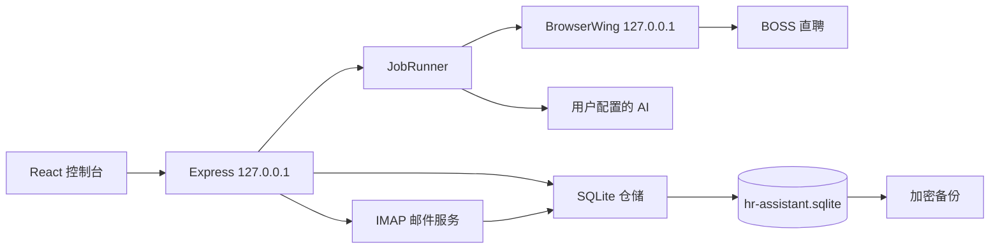

# 单机架构

HR筛选简历助手采用 Electron + 本机 Express + React + SQLite 的单进程业务架构。Electron 负责启动 BrowserWing 和后端，React 控制台通过同源 HTTP 调用本地 API。

## 分层

- `src/core/`：运行编排与端口接口。
- `src/db/localDatabase.ts`：SQLite 打开、PRAGMA、事务和迁移。
- `src/db/sqliteCandidateRepository.ts`：运行、候选人、评估和统计。
- `src/db/sqliteJobDescriptionRepository.ts`：JD CRUD。
- `src/mail/sqliteRepository.ts`：邮件、附件 BLOB、联系方式和候选人合并。
- `src/server/`：仅本机 API。
- `src/backupService.ts`：一致性快照、压缩、认证加密、校验和回滚。
- `web/src/`：本地主控制台，启动后直接进入。
- `electron/`：Windows 桌面启动、回环网络和 NSIS 构建。

## 数据生命周期

SQLite 迁移版本记录在 `schema_migrations`。应用升级继续使用同一个用户数据目录，启动时按顺序执行缺失迁移。备份恢复会拒绝高于当前应用支持版本的数据库；低版本数据库恢复后自动迁移。

邮箱首次启用创建最新 UID 基线。每封邮件使用邮箱/UIDVALIDITY/UID 和 Message-ID 去重，PDF 内容保存在 `resume_attachments.pdf_data`。候选人通过电话、邮箱、附件哈希和受控的同名规则合并。

## 安全边界

- 后端与 BrowserWing 只监听 IPv4 回环地址。
- 不启用开放 CORS。
- AI Key 和邮箱授权码各自使用本机密钥加密。
- 备份使用 `scrypt` + AES-256-GCM 整体加密。
- 恢复只接受固定文件白名单，拒绝路径穿越和不兼容版本。
